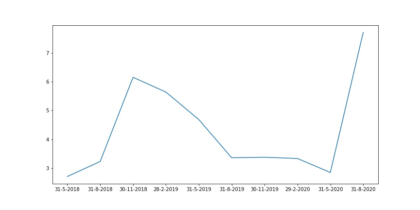

# Momentum Strategy

## Basic Idea
There is substantial evidence that indicates that stocks that perform the best (worst)
over a three to 12 month period tend to continue to perform well (poorly) over the
subsequent three to 12 months. Momentum trading strategies that exploit this
phenomenon

## Data
The company tickers are extracted from [NSE](https://www.nseindia.com/companies-listing/corporate-filings-financial-results) and [BSE](https://www.bseindia.com/corporates/List_Scrips.aspx).
The data for all the Active companies is extracted from Yahoo Finance API using yfinance package. We store the monthly return for all the companies in price_dat.csv, and the new companies for whwich data is not available for our
required period we store those tickers in new_companies.csv

## Implementation
We use the monthly returns of the companies to produce two dataframes, one contains the returns for a period interval of holding period and another for the look back period.
We use the look back period dataframe to divide companies into deciles and select the companies which we have to short or long according to the strategy.
And the holding period datafame is to calculate the return earned at the end of the holding period.

## Result
We have ploted the returns earned. These return are for the holding period of 3 months and look back period of 6 months

